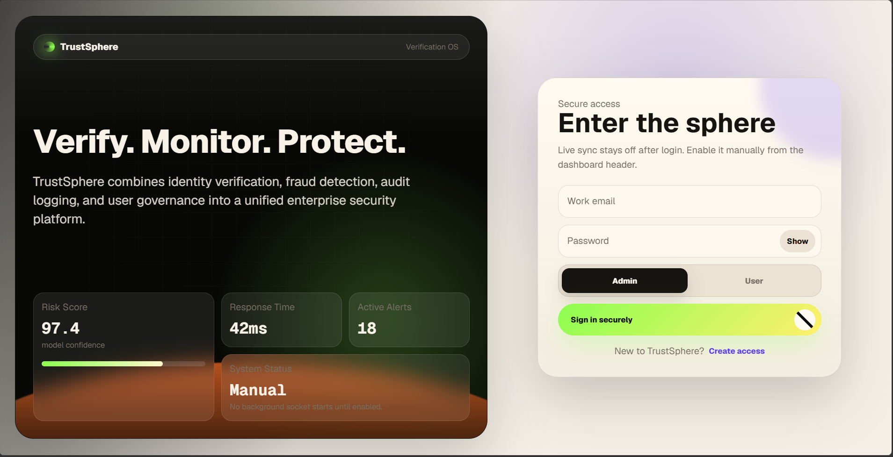
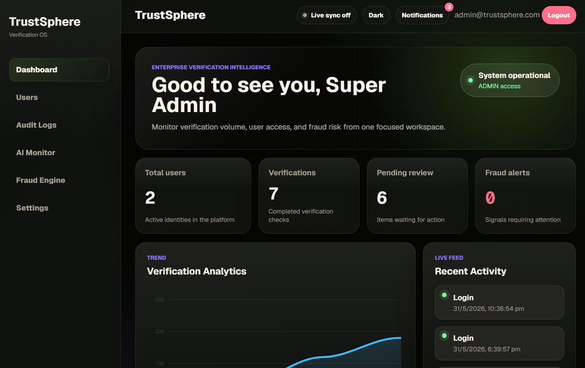
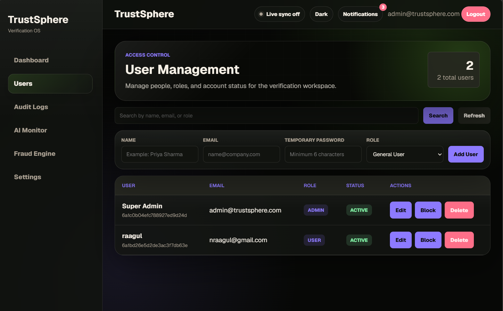
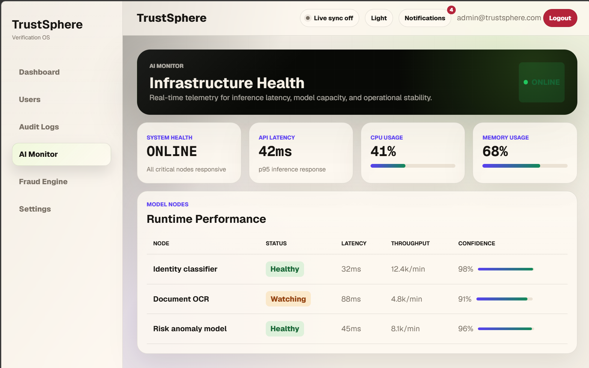
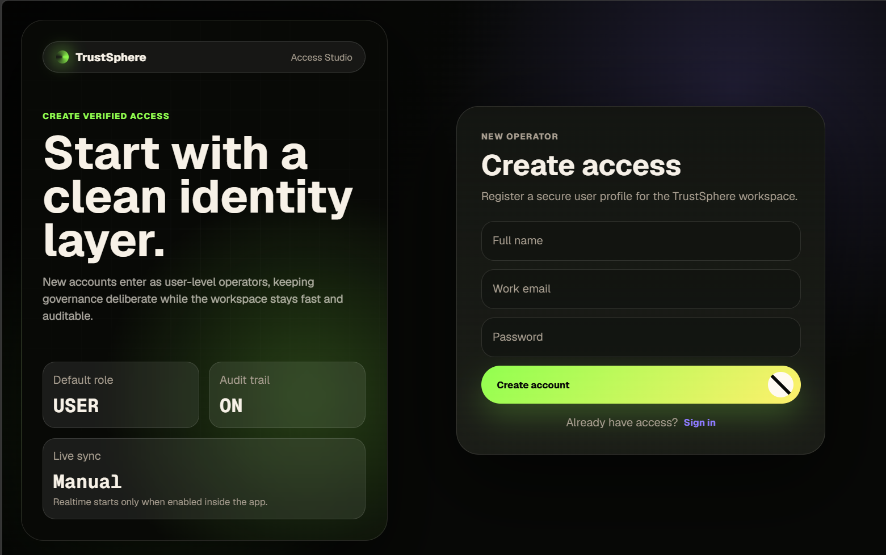
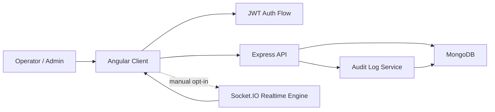

# TrustSphere

TrustSphere is a full-stack verification intelligence dashboard for identity review, fraud monitoring, audit visibility, and role-based user governance. It is built as a portfolio-grade security operations product with a polished Angular interface, an Express/MongoDB API, JWT authentication, admin-only user management, paginated audit data, and opt-in realtime sync through Socket.IO.

The product goal is simple: give teams one focused command surface to verify, monitor, and protect trust signals without burying operators in noisy enterprise UI.

## Screenshots

<p>
  
</p>

<table>
  <tr>
    <td>
      
    </td>
    <td>
      
    </td>
  </tr>
  <tr>
    <td>
      
    </td>
    <td>
      
    </td>
  </tr>
</table>

## Table of Contents

- [Highlights](#highlights)
- [Screenshots](#screenshots)
- [Tech Stack](#tech-stack)
- [Architecture](#architecture)
- [Project Structure](#project-structure)
- [Core Features](#core-features)
- [Getting Started](#getting-started)
- [Environment Variables](#environment-variables)
- [Available Scripts](#available-scripts)
- [API Overview](#api-overview)
- [Realtime Sync](#realtime-sync)
- [RBAC Model](#rbac-model)
- [Performance Notes](#performance-notes)
- [UI System](#ui-system)
- [Verification Checklist](#verification-checklist)
- [Troubleshooting](#troubleshooting)

## Highlights

- Premium Angular dashboard with handcrafted dark/light theme styling.
- JWT-secured API with protected routes and admin-only user governance.
- Manual live-sync toggle so realtime traffic starts only when the user enables it.
- Paginated Users and Audit Logs views for faster dashboard loading.
- Cached dashboard metrics to avoid redundant database pressure.
- Socket.IO notifications for realtime operational events.
- Audit logging for critical auth and user-management actions.
- MongoDB indexes for frequently queried user, audit, and verification collections.
- Responsive auth, dashboard, settings, fraud, audit, and monitor screens.

## Tech Stack

| Layer | Technology |
| --- | --- |
| Frontend | Angular 21, Angular Router, Reactive Forms |
| Styling | SCSS, CSS variables, custom responsive layouts |
| Charts | ApexCharts via `ng-apexcharts` |
| Realtime | Socket.IO client/server |
| Backend | Node.js, Express 5, TypeScript |
| Database | MongoDB with Mongoose |
| Auth | JWT, bcrypt password hashing |
| Tooling | Angular CLI, TypeScript, Prettier |

## Architecture



The frontend is a standalone Angular application with lazy-loaded feature routes. The backend exposes a REST API, protects private routes with JWT middleware, restricts user-management routes to admins, and emits realtime events for user, dashboard, audit, and notification updates.

## Project Structure

```text
TrustSphere/
├── .gitignore
├── README.md
├── docs/
│   └── screenshots/
├── backend/
│   ├── .env.example
│   ├── package.json
│   ├── tsconfig.json
│   └── src/
│       ├── app.ts
│       ├── controllers/
│       ├── middleware/
│       ├── models/
│       ├── routes/
│       ├── scripts/
│       ├── services/
│       └── sockets/
└── frontend/
    ├── package.json
    ├── angular.json
    └── src/
        ├── app/
        │   ├── core/
        │   ├── features/
        │   ├── layout/
        │   └── shared/
        ├── environments/
        ├── index.html
        ├── main.ts
        └── styles.scss
```

## Core Features

### Authentication

- Login and registration screens with reactive validation.
- Passwords are hashed with bcrypt before storage.
- JWT is saved client-side after login and attached to protected API calls.
- Logout clears local auth state.

### Dashboard

- Metrics for total users, verification volume, pending review, and fraud alerts.
- Verification analytics chart.
- Recent activity feed backed by audit log data.
- Loading states and error fallbacks for API failures.

### Users

- Admin-only route and sidebar entry.
- Paginated user list.
- Search support.
- Create, edit, delete, and status toggle actions.
- Optimistic UI updates for user changes.

### Audit Logs

- Protected audit-log route.
- Paginated and searchable audit log table.
- Cache headers for short-lived audit responses.
- Realtime append behavior when live sync is enabled.

### AI Monitor and Fraud Engine

- Security-monitoring surfaces for operational signals.
- Scannable metric cards and structured data tables.
- Risk-oriented visual language for alerts and status signals.

### Settings

- Appearance preferences.
- Light/dark theme toggle.
- Placeholder settings for profile and notification preferences.

## Getting Started

### Prerequisites

- Node.js 20 or newer
- npm
- MongoDB running locally or a MongoDB Atlas connection string

### 1. Clone and install

```bash
git clone <your-repository-url>
cd TrustSphere

cd backend
npm install

cd ../frontend
npm install
```

### 2. Configure backend environment

Create `backend/.env`:

```env
PORT=5000
MONGO_URI=mongodb://127.0.0.1:27017/trustsphere
JWT_SECRET=replace_with_a_long_random_secret
```

Never commit real production secrets.

### 3. Configure frontend API URL

The development API URL is defined in:

```text
frontend/src/environments/environment.ts
```

Default:

```ts
export const environment = {
  apiUrl: 'http://localhost:5000/api',
};
```

### 4. Start the backend

```bash
cd backend
npm run dev
```

The API runs on `http://localhost:5000` by default.

### 5. Start the frontend

```bash
cd frontend
npm start
```

The Angular app runs on `http://localhost:4200` by default.

## Environment Variables

| Variable | Required | Description |
| --- | --- | --- |
| `PORT` | No | Backend server port. Defaults to `5000`. |
| `MONGO_URI` | Yes | MongoDB connection string. |
| `JWT_SECRET` | Yes | Secret used to sign and verify JWT tokens. |

## Available Scripts

### Frontend

| Command | Description |
| --- | --- |
| `npm start` | Starts the Angular dev server. |
| `npm run build` | Builds the frontend for production. |
| `npm run watch` | Runs Angular build in watch mode. |
| `npm test` | Runs frontend tests. |

### Backend

| Command | Description |
| --- | --- |
| `npm run dev` | Starts the Express API with `ts-node-dev`. |
| `npx tsc --noEmit` | Type-checks the backend without emitting files. |

## API Overview

All private endpoints expect:

```http
Authorization: Bearer <jwt_token>
```

### Auth

| Method | Endpoint | Access | Description |
| --- | --- | --- | --- |
| `POST` | `/api/auth/register` | Public | Creates a user account. |
| `POST` | `/api/auth/login` | Public | Authenticates a user and returns a JWT. |

### Dashboard

| Method | Endpoint | Access | Description |
| --- | --- | --- | --- |
| `GET` | `/api/dashboard/metrics` | Authenticated | Returns cached dashboard metrics. |
| `GET` | `/api/dashboard/analytics` | Authenticated | Returns chart-ready analytics data. |
| `GET` | `/api/dashboard/activity` | Authenticated | Returns recent activity feed items. |

### Users

| Method | Endpoint | Access | Description |
| --- | --- | --- | --- |
| `GET` | `/api/users?page=1&limit=20&search=` | Admin | Returns paginated users. |
| `POST` | `/api/users` | Admin | Creates a user. |
| `PUT` | `/api/users/:id` | Admin | Updates a user. |
| `DELETE` | `/api/users/:id` | Admin | Deletes a user. |

### Audit Logs

| Method | Endpoint | Access | Description |
| --- | --- | --- | --- |
| `GET` | `/api/audit?page=1&limit=25&search=` | Authenticated | Returns paginated audit logs. |

## Realtime Sync

Live sync is disabled by default after login. Users must manually enable it from the navbar.

When enabled, the frontend connects to the Socket.IO server and listens for:

| Event | Purpose |
| --- | --- |
| `notification` | Operational notifications. |
| `audit:created` | Newly created audit records. |
| `users:changed` | User create/update/delete refresh signals. |
| `dashboard:changed` | Dashboard refresh signals. |

When disabled, the client removes socket listeners, disconnects the socket, and avoids background realtime fetches.

## RBAC Model

TrustSphere uses two roles:

| Role | Permissions |
| --- | --- |
| `USER` | Can access dashboard, audit logs, AI monitor, fraud engine, and settings. |
| `ADMIN` | Includes user access plus full Users tab management. |

RBAC is enforced in both places:

- Frontend route guard and sidebar visibility.
- Backend `protect` and `requireAdmin` middleware on `/api/users`.

## Performance Notes

- Users and Audit Logs use pagination to avoid loading entire collections into the browser.
- Dashboard metrics use short-lived backend caching.
- MongoDB indexes exist on common sort/search fields:
  - `User.createdAt`
  - `User.role/status`
  - `User.name/email`
  - `AuditLog.createdAt`
  - `AuditLog.actor/action/target`
  - `Verification.status`
  - `Verification.riskLevel`
- Angular routes are lazy-loaded.
- Realtime sync is manual opt-in to reduce unnecessary socket traffic.

## UI System

The interface uses a premium security-operations design language:

- Deep obsidian surfaces with soft contrast borders.
- Light/dark theme support through global CSS variables.
- High-readability typography using Geist font families.
- Dense but readable dashboard cards and tables.
- Subtle hover states, transitions, and glass-like panels.
- Authentication screens designed as recruiter-facing first impressions.

## Verification Checklist

Before pushing or deploying, run:

```bash
cd frontend
npm run build

cd ../backend
npx tsc --noEmit
```

Manual QA checklist:

- Register a new user.
- Login as `USER` and confirm the Users tab is hidden and blocked.
- Login as `ADMIN` and confirm Users management works.
- Open Dashboard, Audit Logs, AI Monitor, Fraud Engine, and Settings.
- Enable and disable Live Sync from the navbar.
- Confirm the notification panel appears above page content.
- Toggle light/dark mode and refresh the browser.

## Troubleshooting

### Frontend cannot reach backend

Confirm the backend is running and `frontend/src/environments/environment.ts` points to the correct API URL.

### Login returns invalid token

Ensure `JWT_SECRET` is present in `backend/.env` and the backend was restarted after changing it.

### MongoDB connection fails

Check that MongoDB is running locally or that the Atlas URI is valid and network access is allowed.

### Realtime notifications do not appear

Live sync is intentionally disabled by default. Enable it from the navbar before testing socket events.

### Users tab does not appear

Only accounts with role `ADMIN` can view or access user management.
